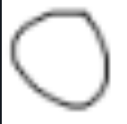
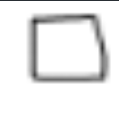
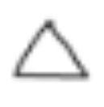

# Using Neural Network to recognize hand drawn shapes.

 Images of Handwritten Shapes:

       -> circles
       -> squares 
       -> triangles 

       
       
       
       

You can either open via kaggle notebook or local machine.

               

